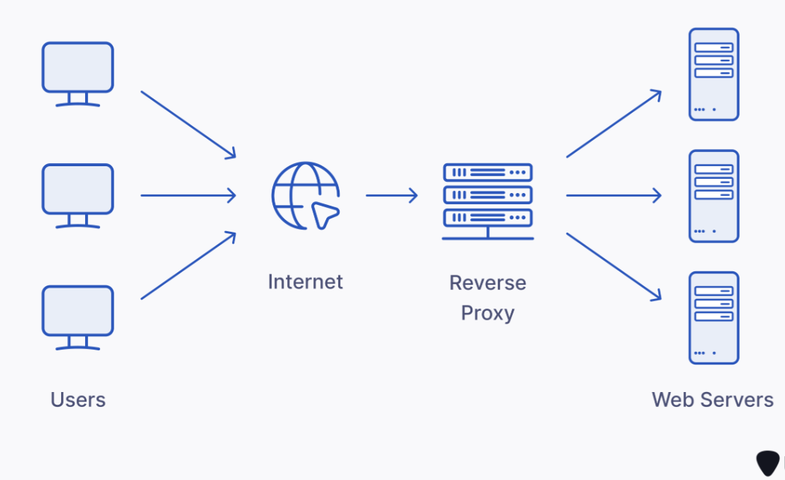

# Go Proxy Server



A simple and efficient HTTP/HTTPS proxy server built using Go. This proxy server forwards client requests to backend servers, with support for request logging, basic caching, and concurrency handling.

## Features

- HTTP/HTTPS Proxy: Forward HTTP/HTTPS requests from clients to backend servers.
- Request Logging: Logs incoming requests and responses for monitoring and debugging.
- Caching (optional): Cache responses to reduce load on backend servers.
- Concurrency: Handle multiple client connections using Go's goroutines and channels for high performance.
- Customizable: Extendable with additional features such as authentication, rate-limiting, or load balancing.

## Installation

Follow the steps below to set up and run the proxy server.

## Prerequisites

- Go 1.x or higher installed.
- Git (optional, for cloning the repository).

## Clone the Repository

Clone the repository to your local machine:

```bash
git clone https://github.com/josiah-mbao/go-proxy-server.git
cd go-proxy-server
Install Dependencies
```

Run the following command to fetch dependencies:

```bash
go mod tidy
```

## Configuration

Edit the server.go file or create a configuration file to customize the proxy server settings such as the port number, backend server address, and caching options.

## Usage

Running the Server
Start the proxy server using the following command:

```bash
go run server.go
```

By default, the server listens on port 8080. You can modify this in the configuration.

Making Requests Through the Proxy
Once the server is running, you can route HTTP/HTTPS requests through the proxy. For example, you can use curl to make a request via the proxy:

```bash
curl -x http://localhost:8080 http://example.com
```

Or configure your web browser to use localhost:8080 as the proxy server.

## Stopping the Server

To stop the server, simply press Ctrl + C in your terminal.

## Contributing

We welcome contributions! If you have suggestions for improvements, bug fixes, or new features, please follow these steps:

1. Fork the repository.
2. Create a new branch for your feature or fix.
3. Make your changes and commit them.
4. Push to your fork and open a pull request.

## License

This project is licensed under the MIT License - see the LICENSE file for details.
